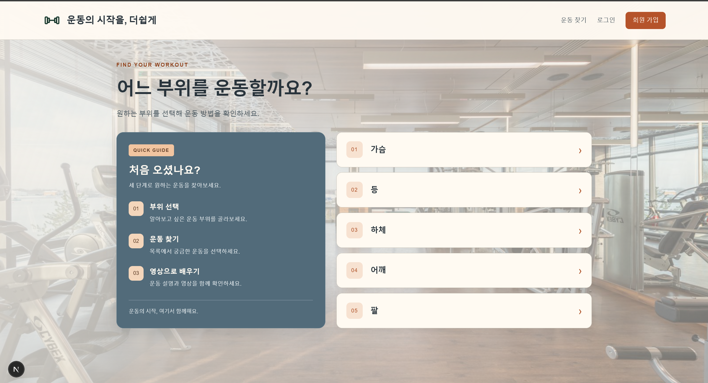
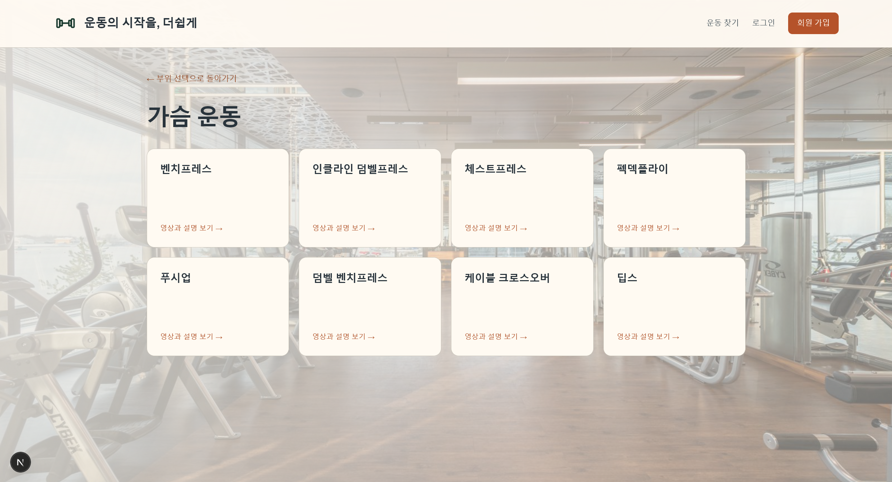
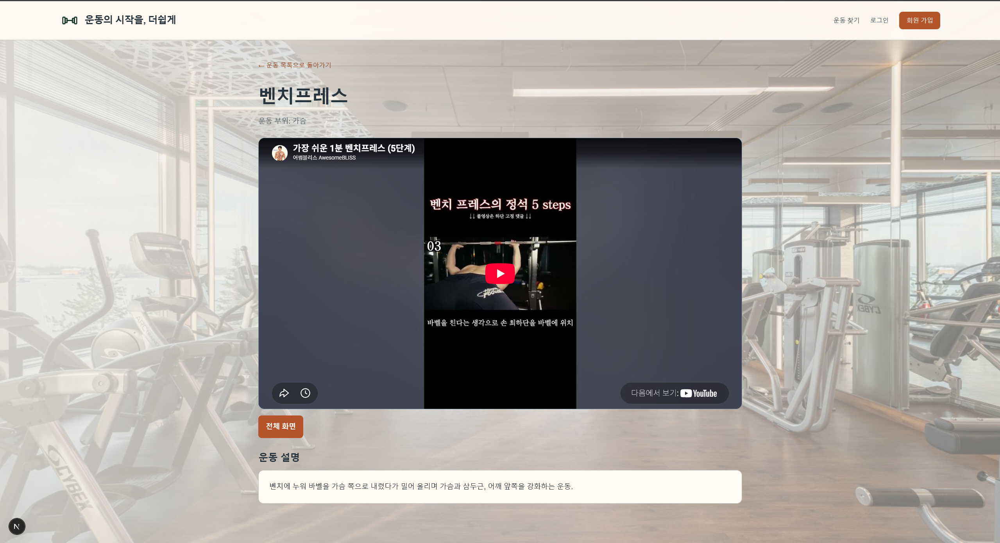

# 운동가이드 - 유능한

운동 부위를 선택하면 해당 부위의 운동 목록을 보여주고, 운동을 선택하면 설명과 YouTube 영상을 제공하는 Next.js 기반 개인 프로젝트입니다.

## 1. 프로젝트 소개

- **프로젝트 이름:** 운동가이드
- **프로젝트 주제:** 헬스 초보자를 위한 부위별 운동 영상 가이드
- **제작 목적:** 부위별 운동 종류와 운동 방법을 한곳에서 쉽게 찾아볼 수 있도록 제작했습니다.
- **주요 사용자:** 운동 종류와 자세를 알아보고 싶은 헬스 초보자
- **개발 기간:** 9/30 ~ 10/2
- **개발자:** 유능한

## 2. 주요 기능

### 운동 부위 선택

가슴·등·하체·어깨·팔 중 원하는 부위를 선택할 수 있습니다. 메인 화면의 이용 안내 카드에서 서비스 사용 순서도 확인할 수 있습니다.

### 부위별 운동 목록 조회

JSON Server에서 전체 운동 데이터를 불러온 뒤, 선택한 부위에 해당하는 운동만 필터링하여 표시합니다. 사용자는 운동 이름을 확인하고 상세 화면으로 이동할 수 있습니다.

### 운동 상세 및 영상 보기

선택한 운동의 이름, 부위, 설명, YouTube 영상을 확인할 수 있습니다. 영상이 등록된 경우 재생할 수 있으며, 전체 화면 버튼으로 영상 영역을 확대할 수 있습니다. 돌아가기 링크를 누르면 해당 부위의 운동 목록으로 이동합니다.

### 로딩·오류·빈 데이터 안내

데이터를 요청하는 동안 로딩 문구를 표시합니다. 요청에 실패하거나 등록된 운동 또는 영상이 없으면 상황에 맞는 안내를 표시합니다.

| 화면             | 주소                | 설명                                         |
| ---------------- | ------------------- | -------------------------------------------- |
| 메인             | `/`                 | 운동 부위 선택과 이용 안내를 제공합니다.     |
| 부위별 운동 목록 | `/exercises/[part]` | URL의 부위에 해당하는 운동을 표시합니다.     |
| 운동 상세        | `/exercise/[id]`    | 운동 ID에 해당하는 설명과 영상을 표시합니다. |

예를 들어 `/exercises/chest`는 가슴 운동 목록이며, `/exercise/1`은 ID가 `1`인 운동의 상세 화면입니다.

**로그인·회원가입 구현 범위**

헤더에는 `/login`, `/signup`으로 이동하는 링크가 있습니다. 기획상 로그인·회원가입은 입력 검증과 화면 이동을 제공하는 시연용 기능이며, 실제 계정 생성과 서버 인증은 범위에 포함하지 않습니다.

## 3. 화면 구성

### 메인 화면



헤더에 로고와 메뉴를 배치하고, 본문에 이용 안내 카드와 다섯 가지 운동 부위 선택 카드를 배치했습니다. 헬스장 배경 사진과 아이보리·블루그레이·오렌지 색상을 사용했습니다.

### 부위별 운동 목록 화면



선택한 부위의 이름과 해당 운동 목록을 카드 형태로 표시합니다. 카드를 누르면 운동 상세 화면으로 이동합니다.

### 운동 상세 화면



운동 이름과 부위, YouTube 영상, 전체 화면 버튼, 운동 설명을 표시합니다. 영상 아래에 설명을 배치하고 해당 부위의 목록으로 돌아가는 링크를 제공합니다.

## 4. 기술 스택

| 기술           | 사용 목적                                                   |
| -------------- | ----------------------------------------------------------- |
| Next.js        | App Router를 이용한 페이지 구성, 동적 라우팅, 공통 레이아웃 |
| React          | 컴포넌트 구성과 상태에 따른 화면 표시                       |
| JavaScript     | 데이터 처리, 이벤트 처리, 비동기 요청                       |
| CSS            | Flexbox·Grid 배치, 색상, 반응형 화면 구성                   |
| Fetch API      | JSON Server에 운동 데이터 요청                              |
| JSON Server    | `db.json`의 운동 데이터를 조회하는 개발용 API               |
| YouTube iframe | 저장한 영상 ID를 이용한 영상 삽입                           |

Axios, Zustand, TanStack Query는 사용하지 않았습니다.

## 5. 설치 및 실행 방법

Node.js와 npm이 설치된 환경에서 실행합니다. 패키지 버전은 저장소의 `package.json`과 `package-lock.json`을 기준으로 합니다.

### 1. 저장소 복제

아래의 `저장소주소`를 실제 GitHub 저장소 주소로 바꿉니다.

```bash
git clone 저장소주소
```

### 2. 프로젝트 폴더로 이동

`프로젝트폴더명`을 복제한 폴더 이름으로 바꿉니다. `package.json`이 있는 폴더에서 다음 명령을 실행합니다.

```bash
cd 프로젝트폴더명
```

### 3. 패키지 설치

```bash
npm install
```

### 4. JSON Server 실행

```bash
npm run server
```

### 5. Next.js 실행

JSON Server를 실행한 터미널은 열어둔 채, 새로운 터미널에서 같은 프로젝트 폴더로 이동하여 실행합니다.

```bash
npm run dev
```

### 접속 주소

- Next.js: http://localhost:3000
- 운동 목록 API: http://localhost:4000/exercises
- 운동 상세 API 예시: http://localhost:4000/exercises/1

Next.js가 다른 포트로 실행되면 터미널에 표시된 접속 주소를 사용합니다. 현재 운동 조회 코드의 API 주소는 `http://localhost:4000`으로 작성되어 있습니다.

### 실행 설정 확인

이 문서의 `npm run server`는 `package.json`의 `scripts`에 다음 항목이 등록되어 있는 것을 전제로 합니다. 기존의 다른 스크립트는 유지합니다.

```json
{
  "dev": "next dev",
  "server": "json-server db.json --port 4000"
}
```

`db.json`은 `package.json`과 같은 폴더에 둡니다. JSON Server가 프로젝트 의존성에 없다면 개발자가 아래 명령으로 설치한 뒤 변경된 `package.json`과 `package-lock.json`을 함께 커밋합니다.

```bash
npm install --save-dev json-server
```

> 제출 전 확인: 실제 `package.json`을 기준으로 스크립트 이름과 명령을 확인하고, 위 실행 순서대로 두 서버가 켜지는지 점검해주세요.

## 6. 주요 폴더와 파일

아래는 공유한 페이지 코드와 import 경로를 기준으로 정리한 구조입니다. `src`를 사용하지 않는 프로젝트라면 `app`, `components`가 최상위에 위치합니다.

| 경로                               | 역할                                          |
| ---------------------------------- | --------------------------------------------- |
| `src/app/layout.js`                | 공통 헤더, 로고, 내비게이션, 페이지 본문 영역 |
| `src/app/page.js`                  | 운동 부위 선택 화면                           |
| `src/app/globals.css`              | 프로젝트 공통 스타일과 반응형 설정            |
| `src/app/exercises/[part]/page.js` | 선택한 부위의 운동 목록                       |
| `src/app/exercise/[id]/page.js`    | 선택한 운동의 상세 정보                       |
| `src/components/GuideCard.js`      | 메인 화면의 서비스 이용 안내 카드             |
| `public/images/gym.jpg`            | 헬스장 배경 사진                              |
| `public/images/workout-logo.svg`   | 헤더 로고                                     |
| `db.json`                          | 운동 원본 데이터                              |
| `docs/`                            | README에 사용할 화면 캡처 저장 위치           |
| `package.json`                     | 패키지 의존성과 실행 스크립트                 |

`docs` 폴더는 화면 캡처를 정리하면서 추가합니다. 로그인·회원가입 페이지의 경로는 실제 파일을 확인한 뒤 표에 추가합니다.

## 7. 컴포넌트 설계와 상태 관리

### 주요 컴포넌트

| 컴포넌트             | 역할                                                                           |
| -------------------- | ------------------------------------------------------------------------------ |
| `RootLayout`         | 모든 페이지에 공통 헤더를 제공하고 `children` 위치에 현재 페이지를 표시합니다. |
| `HomePage`           | 운동 부위 배열을 `map()`으로 출력하고 목록 화면으로 연결합니다.                |
| `GuideCard`          | 서비스 이용 순서를 별도 컴포넌트로 표시합니다.                                 |
| `ExerciseListPage`   | 전체 운동을 조회하고 현재 부위의 운동만 필터링합니다.                          |
| `ExerciseDetailPage` | URL에서 받은 ID로 운동 한 개를 조회하고 설명과 영상을 표시합니다.              |

공통 화면은 `RootLayout`에 두어 각 페이지에서 반복해서 작성하지 않도록 했습니다. 이용 안내는 `GuideCard`로 분리하여 홈 화면의 목록 코드와 구분했습니다. 운동 조회와 관련된 상태는 데이터를 사용하는 목록·상세 페이지에서 각각 관리합니다.

### 상태 관리

| 값                    | 관리 위치 및 방법              | 사용 이유                                   |
| --------------------- | ------------------------------ | ------------------------------------------- |
| 현재 화면             | Next.js App Router             | URL에 맞는 페이지를 표시하기 위해           |
| 선택한 부위           | 목록 페이지의 `useParams()`    | `[part]`에 해당하는 URL 값을 받기 위해      |
| 선택한 운동 ID        | 상세 페이지의 `useParams()`    | `[id]`에 해당하는 운동을 조회하기 위해      |
| 운동 목록 `exercises` | 목록 페이지의 `useState([])`   | API에서 받은 전체 운동 목록을 저장하기 위해 |
| 운동 상세 `exercise`  | 상세 페이지의 `useState(null)` | 조회한 운동 한 개의 정보를 저장하기 위해    |
| 로딩 여부 `loading`   | 각 페이지의 `useState(true)`   | 요청 중 안내를 표시하기 위해                |
| 오류 메시지 `error`   | 각 페이지의 `useState('')`     | 조회 실패 원인을 화면에 표시하기 위해       |

`useEffect`에서 API를 요청하고, `async/await`로 응답과 JSON 변환 결과를 받습니다. 목록 페이지는 마운트 시 데이터를 조회하고, 상세 페이지는 `id`가 바뀌면 해당 운동을 다시 조회합니다.

화면과 선택한 부위·운동 ID를 최상위 `App`의 상태로 관리하지 않고 URL로 구분합니다. 따라서 `/exercises/chest`에서 새로고침하면 같은 주소에서 데이터를 다시 조회합니다.

### 데이터 흐름

1. 홈에서 가슴을 선택하면 `/exercises/chest`로 이동합니다.
2. 목록 페이지는 `useParams()`로 `part` 값인 `chest`를 받습니다.
3. `partNames[part]`로 `chest`를 데이터의 부위명인 `가슴`과 연결합니다.
4. `GET /exercises`로 받은 배열에서 `part`가 `가슴`인 운동만 표시합니다.
5. 운동을 선택하면 `/exercise/운동ID`로 이동합니다.
6. 상세 페이지는 `GET /exercises/운동ID`로 운동 한 개를 조회합니다.
7. 응답의 `youtubeId`를 iframe 주소에 넣어 영상을 표시합니다.

### 운동 데이터

| 필드          | 자료형 | 의미                              |
| ------------- | ------ | --------------------------------- |
| `id`          | 문자열 | 운동을 구분하는 고유 ID           |
| `name`        | 문자열 | 운동 이름                         |
| `part`        | 문자열 | 가슴·등·하체·어깨·팔 중 운동 부위 |
| `description` | 문자열 | 운동 설명                         |
| `youtubeId`   | 문자열 | YouTube 영상 ID                   |

YouTube 검색 API는 사용하지 않습니다. 영상 ID를 `db.json`에 직접 저장하고 iframe으로 삽입합니다.

## 8. 트러블슈팅

### 추가한 운동이 부위별 목록에 표시되지 않는 문제

**문제**

`db.json`에 스쿼트를 추가했지만 하체 운동 목록에 표시되지 않았습니다.

**원인**

홈 화면의 `parts` 배열에 작성한 `value` 값이 목록 페이지에서 사용하는 부위 매핑 키와 일치하지 않았습니다. 이 값으로 이동할 URL을 만들기 때문에, 선택한 부위와 운동 데이터를 올바르게 연결하지 못했습니다.

**해결**

홈 화면의 `page.js`에서 해당 `value` 값을 목록 페이지의 부위 매핑 키와 일치하도록 수정했습니다. 하체는 `legs`로 연결하고, 목록 페이지에서는 이를 `하체`로 변환해 데이터를 필터링하도록 맞췄습니다.

**알게 된 점**

홈 화면에서 링크에 넣는 값이 URL을 통해 목록 페이지로 전달된다는 것을 이해했습니다. 데이터를 추가하는 것뿐 아니라, 링크에 사용하는 값과 부위 매핑 키가 일치하는지도 확인해야 한다는 것을 배웠습니다.

## 9. 프로젝트 회고

이번 프로젝트에서는 운동 부위 선택부터 목록 조회, 영상 확인까지 이어지는 서비스를 직접 기획하고 구현했습니다. 문법을 따로 공부할 때와 달리, 프로젝트에서는 어떤 화면과 상태가 필요한지 스스로 결정해야 한다는 점이 어려웠습니다.

특히 Next.js의 폴더 이름과 URL이 연결되는 원리, `useParams()`로 받은 값을 API 요청에 사용하는 방법을 이해할 수 있었습니다. 또한 데이터를 요청하는 과정과 받아온 데이터를 화면에 표시하는 과정이 구분된다는 점을 배웠습니다.

운동 데이터를 추가했는데 화면에 표시되지 않는 문제를 해결하면서, 데이터 파일뿐 아니라 홈 화면의 링크 값과 목록 페이지의 부위 매핑도 함께 확인해야 한다는 것을 배웠습니다. 화면이 예상과 다를 때 데이터가 전달되는 순서를 따라가며 원인을 찾는 것이 중요하다고 느꼈습니다.

앞으로는 운동 이름 검색과 즐겨찾기 기능, daily 운동추천, 개인 운동기록을 추가하고 싶습니다 그리고 로그인·회원가입도 실제 백엔드와 연결하여 구현하는 방법을 학습하고 싶습니다
